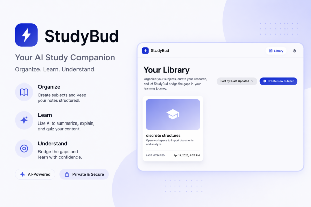

<p align="center">
  
</p>
<center>Enhance your academic performance with AI.</center>

---

AI-powered desktop app that turns lecture and homework PDFs into a structured study workspace with division-based analysis, grounded chat, flashcards, practice generation, and in-app research.

Electron / React / TypeScript / SQLite / Vite / PDF.js / OpenAI / Ollama

---

## Table of Contents

- [Features](#features)
- [Architecture](#architecture)
- [Quick Start](#quick-start)
- [Platform Guides](#platform-guides)
  - [Windows](#windows)
  - [macOS](#macos)
  - [Linux / WSL](#linux--wsl)
- [AI Providers](#ai-providers)
- [OCR](#ocr)
- [Scripts Reference](#scripts-reference)
- [Troubleshooting](#troubleshooting)
- [License](#license)

---

## Features

- **PDF import** with automatic text extraction and selective OCR for scanned pages
- **AI subject analysis** that breaks material into divisions, summaries, key concepts, and problem types
- **Grounded chat** scoped to divisions or highlighted text, with cited source pages
- **Flashcards** -- AI-generated or manually authored, with fullscreen flip-card study mode
- **Practice generation** by problem type and difficulty, with revealable answer keys
- **Research tab** with suggested queries, video results, and an in-app browser
- **Local-first persistence** via SQLite with configurable data path
- **Encrypted settings** via OS keychain (macOS Keychain, Windows DPAPI)

## Architecture

```
src/
  main.ts                         Electron main process
  preload.ts                      Typed IPC bridge
  shared/ipc.ts                   Shared IPC contracts and types
  main/db/                        SQLite persistence (Drizzle ORM)
  main/documents/                 PDF import pipeline + utility worker
  main/pdf/                       PDF.js text extraction
  main/ocr/                       OCR runtime resolution + execution
  main/analysis/                  AI division analysis
  main/chat/                      Grounded division chat
  main/flashcards/                Flashcard generation
  main/practice/                  Practice problem generation
  main/research/                  Web/video search + BrowserView
  main/menu/                      macOS application menu
  ui/                             React renderer (Tailwind, Radix)
resources/
  ocr/                            Python OCR runner + requirements
  ocr-runtime/                    Bundled OCR runtimes (per-platform)
  branding/                       App icons (.icns, .ico, .png)
```

See also: [roadmap.md](./roadmap.md) | [release-readiness.md](./release-readiness.md) | [codex-context.md](./codex-context.md)

## Quick Start

```bash
npm install
npm run rebuild:native:electron
npm run dev
```

Then open **Settings** and configure an [AI provider](#ai-providers).

---

## Platform Guides

### Windows

**Prerequisites:** Node.js, npm, and a native-module toolchain (Visual Studio Build Tools or `windows-build-tools`).

```bash
npm install
npm run dev                  # launch in development
```

**Package for distribution** (bundles OCR + Tesseract into a self-contained Squirrel installer):

```bash
npm run make                 # outputs to out/make/squirrel.windows/
```

OCR is bundled automatically during packaging via `npm run prepare:ocr-runtime`. To build the OCR runtime manually:

```bash
npm run build:ocr:win        # requires Python 3 + PyInstaller + Tesseract on PATH
```

See [`resources/ocr-runtime/README.md`](./resources/ocr-runtime/README.md) for the bundled runtime layout and env-var overrides.

---

### macOS

Supports macOS 11+ on Apple Silicon (arm64) and Intel (x64). Builds are per-arch, not universal.

**Prerequisites:**

```bash
xcode-select --install
brew install python tesseract
```

**Install and run:**

```bash
npm install
npm run rebuild:native:electron
npm run dev
```

In dev mode, OCR uses a Python fallback against Homebrew's `tesseract`. `safeStorage` is backed by macOS Keychain.

**Package for distribution** (bundles OCR + relocated Tesseract dylibs into a `.app` / `.dmg` / `.zip`):

```bash
npm run make                 # outputs to out/make/
```

To build the OCR runtime standalone:

```bash
npm run build:ocr:mac        # requires Python 3 + PyInstaller + brew tesseract
```

The build script copies Tesseract + leptonica dylibs and rewrites load paths via `install_name_tool` so the bundle is self-contained without Homebrew on the target machine.

**Distribution is unsigned.** First launch requires one of:

```bash
xattr -dr com.apple.quarantine /Applications/StudyBud.app
# or: right-click the app > Open > confirm Gatekeeper prompt
```

Signing/notarization can be wired into `forge.config.ts` (`osxSign` / `osxNotarize`) later.

---

### Linux / WSL

Works for development. Produces `.deb` and `.rpm` packages, but **bundled OCR is not yet supported** -- packaged Linux builds will report OCR as unavailable.

**Prerequisites:** Node.js, npm, Python 3, `tesseract-ocr`.

```bash
# Ubuntu/WSL
sudo apt-get install -y tesseract-ocr

npm install
npm run dev
```

**Dev OCR setup** (optional):

```bash
python3 -m venv .venv
.venv/bin/pip install -r resources/ocr/requirements.txt
```

**WSL notes:** Electron external links, Ollama access (if Ollama runs on the Windows host), and native rebuilds can behave differently under WSL. If something is broken in WSL but not on bare Windows, that's a real possibility.

---

## AI Providers

Configure in **Settings** after launching the app.

| Provider | Best for | Requires |
|----------|----------|----------|
| **OpenAI** | Stronger analysis, structured outputs, large subjects | API key + internet |
| **Ollama** | Free local inference, private iteration | Local server + pulled model (e.g. `qwen3:8b`) |

Optional research providers (also in Settings): **Brave Search API** key, **YouTube Data API** key.

## OCR

Packaged builds (Windows, macOS) ship a **fully bundled OCR runtime** -- no Python or Tesseract install required on the end-user machine. The bundle includes:

- A PyInstaller-frozen Python interpreter with PyMuPDF + pytesseract
- A vendored Tesseract binary + tessdata + shared libraries

In development, OCR falls back to `resources/ocr/ocr_runner.py` using a repo-local `.venv` and system `tesseract`.

Verify OCR health:

```bash
.venv/bin/python resources/ocr/ocr_runner.py --status
# Should print: {"available": true, "engine": "PyMuPDF + pytesseract", ...}
```

## Scripts Reference

| Script | Purpose |
|--------|---------|
| `npm run dev` | Launch Electron in development |
| `npm run package` | Build packaged `.app` / `.exe` (includes OCR prep + native rebuild) |
| `npm run make` | Package + create platform installers (Squirrel, DMG, ZIP, deb, rpm) |
| `npm run build:ocr:win` | Build Windows OCR runtime (must run on Windows) |
| `npm run build:ocr:mac` | Build macOS OCR runtime (must run on macOS) |
| `npm run typecheck` | TypeScript type check |
| `npm run lint` | ESLint |
| `npm run test` | Vitest suite |
| `npm run verify` | typecheck + lint + test + package |
| `npm run rebuild:native:electron` | Rebuild `better-sqlite3` for Electron's ABI |
| `npm run rebuild:native:node` | Rebuild `better-sqlite3` for Node's ABI (for tests) |

## Troubleshooting

**`better-sqlite3` module errors** -- run `npm run rebuild:native:electron` (or `rebuild:native:node` for test failures).

**Ollama analysis/chat fails** -- confirm Ollama is running, the base URL is correct, and the model is pulled locally. Weak models may struggle with large subjects.

**Imported PDF has no usable text** -- the PDF is likely scanned/image-only. Check OCR availability with `.venv/bin/python resources/ocr/ocr_runner.py --status`. Install missing deps (`pip install -r resources/ocr/requirements.txt`, `apt install tesseract-ocr` or `brew install tesseract`).

**App opens in browser instead of desktop window** -- always launch with `npm run dev`, not by opening the Vite dev server URL directly.

## License

MIT
